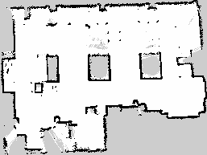
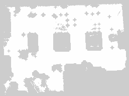

## MAPUPDATE

### Explanation

This package provides a program which updates a already existing occupancy grid map of an environment. In order to update a map the program uses build costmaps over several days and if a new object is detected multiple days in a row, or if a object is missing multiple days in a row, the occupancy grid map is updated accordingly.
So what is package allows is a mapupdate for slightly dynamic environments.
All the parameterisable parameters of this package are explained in the following.

The program uses C++ for the determination of new and removed objects, but a Python script is resposible for creating all needed directorys as well as starting and ending all needed subprograms for the mapupdate.
This porgram will create new directories inside the map_update directory in order to handle all the needed files for the mapupdate.
These directories are:
  - build_costmaps_on_destination
  - same_day_maps
  - different_day_maps
  - updated_map_after_multiple_days
  - csv_files
  - unoccupied_base_map

### Installation
In order to use the map_update package we first need to install different ROS- packages and python librarys.
The needed commands are the following (first make sure your pip install is up-to-date):
```
pip install subprocess
```
```
pip install numpy
```
```
pip install glob2
```
```
sudo apt-get install ros-noetic-geometry-msgs
```
Further more you need to make sure that you have a C++ 17 compatible compiler (for example GNU GCC11).

### Parameters
The mapupdate has several different parameters which can be manipulated in order to better suit your needs/incidents.
The following will show all changable parameters of the mapupdate.

REMINDER!: ALL USED MAPS / MAP-FILES HAVE TO ORIGINATE FROM THE SAME MAP!!!

base_map_ros_pkg: Give/Name the ROS-Package where the initial/base maps you want to use are located.
```
Parameter: base_map_ros_pkg | Default Value = "map_update"
```

base_map_path: Give/Name the full path (including the file name) of the saved occupancy grid map you want to use (HERE THE .pgm FILE IS NEEDED)
```
Parameter: base_map_path | Default Value = "/maps/fhws_first_floor_small.pgm"
```

base_map_with_edit_path: Give/Name the full path (including the file name) of the saved and edited occupancy grid map you want to use (HERE THE .pgm FILE IS NEEDED)
```
Parameter: base_map_with_edit_path | Default Value = "/maps/fhws_first_floor_small_edit.pgm"
```

base_map_yaml_file_path: Give/Name the full path (including the file name) of the saved occupancy grid map you want to use (HERE THE .yaml FILE IS NEEDED)
```
Parameter: base_map_yaml_file_path | Default Value = "/maps/fhws_first_floor_small.yaml"
```

changable_grid_cell_deadzone: This parameter sets a so called "deadzone" around occupied cells of the given occupancy grid map. In this deadzone pixels cannot be changed from free to occupied. The changable_grid_cell_deadzone parameter needs to be a positive integer value and tells us how many pixels should not be changable around an occupied cell.
```
Parameter: changable_grid_cell_deadzone | Default Value = 3
```

max_maps_used_per_same_day: This parameter tells us how many resulting so called "compared" maps (originating from the inital/base costmaps) should be generated in one day. New compared maps will always be safed when the robot autonomously arrives at a destination, but only if the max_maps_used_per_same_day count has not been exceeded.
```
Parameter: max_maps_used_per_same_day | Default Value = 5
```

max_maps_used_per_different_days: This parameter tells us how many so called "joined" maps (resulting maps from different days) should be used to generated a new updated initial/base map. In other words, this parameters describes how many days in a row should be taken into account to search for new or removed parts in the environment. New joined maps will always be safed when the robot autonomously arrives at a destination and a new day has been detected, but only if the max_maps_used_per_different_day count has not been exceeded.
```
Parameter: max_maps_used_per_different_days | Default Value = 3
```

removed_objects_safety_distance: This parameter functions similar to the changable_grid_cell_deadzone parameter, but this time it is used on the costmaps which were generated by the initial map without occupied cells (this initial map without occupied cells will be generated by the program itself and is used to search for removed objects). It generates a deadzone  around occupied cells in the maps which will be used to search for removed objets. So objects which are still present get "enlarged" and it is not as possible to remove parts of objects like walls by mistake resulting from the noise of the used sensor for measuring distances.
```
Parameter: removed_objects_safety_distance | Default Value = 1
```

overwrite_initial_map: Define if you want to overwrite the inital map (on the path you gave in the base_map_ros_pkg and base_map_path parameter) with the resulting "new" so called "merged" map after X days (given by the max_maps_used_per_different_days parameter).
```
Parameter: overwrite_initial_map | Default Value = false
```

use_and_overwrite_initial_edited_map: Define if you want to use and overwrite the inital edited map (on the path you gave in the base_map_ros_pkg and base_map_with_edit_path parameter) with the resulting "new" so called "merged" map after X days (given by the max_maps_used_per_different_days parameter) with the changes you made to the initial map.
```
Parameter: use_and_overwrite_initial_edited_map | Default Value = false
```

### Launch

To launch the mapupdate you need to change all parameters (especially the parameters which determine the occupancy grid map you want to use) in the so calles full_mapupdate_launch.launch file.
All parameters of the mapupdate are explained in this launch file.
After changing all the parameters to your needs you can start the launch file by the following command:
```
roslaunch map_update full_mapupdate_launch.launch
```

### Example for the mapupdate
Given a already generated occupancy grid map - for example build with a SLAM-algorithm - like the one seen below.



We genearte four different costmaps. Two will us the "normal" inital map as a static map and two will use a version of the inital map without occupied cells. This initial map without occupied cells will be generated by the program itself. For the given inital map in this example the onoccupied map can bee seen in the picture below.



There will always be two used costmaps - for the "normal" inital map and the unoccupied initial map - because one of the costmaps will have the so calles "clearing" parameter enabled and the other one won´t. If you are not familiar with costmaps you can find informations about them here: http://wiki.ros.org/costmap_2d .

These four costmaps will be started/launch when the robot begins an autonomous navigation. When the robot autonomously arrives at its destination, all four costmaps will be safed and compared with the inital map - using an recursive function - in order to search for new or removed object.

Having build multiple maps in one day - every time the robot arrives at a destination - we will join these maps into a resulting map for this day. After several days these "maps for the day" will be compared to each other to see if we have a new or removed object in all of them. If this is the case the object will be put into the new resulting map for the initial/base map. For our example this could look like the following.


